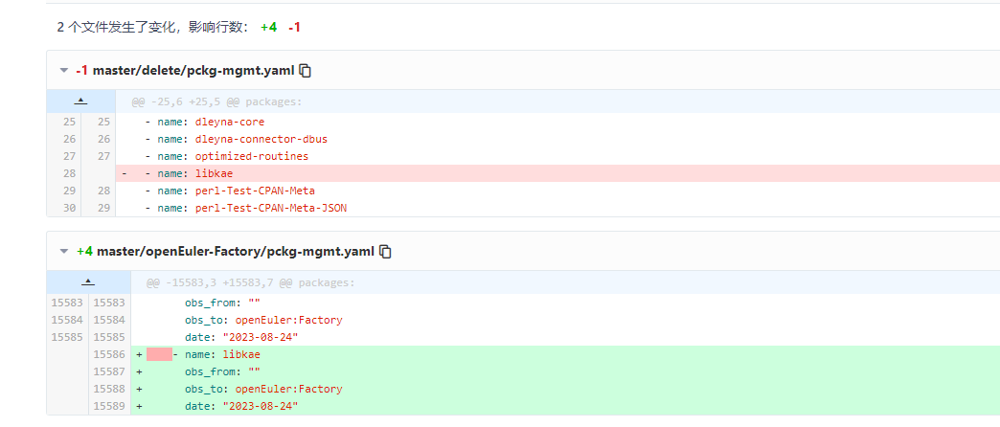
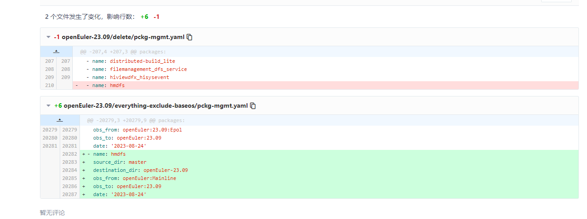

各位openeuler社区的maintainer、committer和contributor好，
openEuler社区master分层构建&版本基线管控优化即将上线，里程碑如下：

1. master分支纳入release-management管控&分层构建——7/27
2. openEuler-22.09基线管控优化——7/27
3. multi-version分支、Next开发分支纳入release-management管控——8/30

上线须知：

    1．	开发者提交PR变更软件包指导：本文第2章
    
    2．	社区对master分支工程做的分层project，如无特别需求，由CICD sig组主导软件包分层，开发者如往常提交PR至openEuler:Mainlien/openEuler:Epol即可。若开发者对于具体软件包的分层有新的建议，欢迎提交issue或者邮件交流！
    
    3．2022/7/27之后，master及openEuler-22.09版本分支对应project的软件包变更入口，统一收归到release-management，即开发者不必再前往obs_meta提交PR！
    
    4．2022/7/27~2022/8/30，下列分支对应project的软件包变更遵循原有流程：https://gitee.com/openeuler/release-management/issues/I4U2VN?from=project-issue
    分支：
    openEuler-20.03-LTS-SP1
    openEuler-20.03-LTS-SP3
    openEuler-22.03-LTS 
    openEuler-22.03-LTS-Next
    
    5．2022/8/30之后，除已停维版本分支，所有开发及版本分支对应project的软件包变更入口，统一收归到release-management，即开发者不必再前往obs_meta提交PR！
    
    6．已停维版本分支原则上不再接受软件包变更PR：openEuler-20.03-LTS/ openEuler-20.03-LTS-Next/openEuler-20.03-LTS-SP2/openEuler-20.09/openEuler-21.03/openEuler-21.09/

以上，如果各位有更好的意见和想法，欢迎在CICD sig提交issue或者邮件交流！

## 1 Relese-management目录优化及pckg-mgmt字段解释

###  纳管master分支

- Note：社区基于master分支工程做的分层project，如无特殊需求，由CICD sig组主导软件包的分层，开发者如往常提交PR至openEuler: Mainline/openEuler:Epol即可。若开发者对于具体软件包的分层有新建议，欢迎提交issue或者邮件交流

| 目录内容                                   | 解释                                                         |
| ------------------------------------------ | ------------------------------------------------------------ |
| delete                                     | 用于管控master下所有删除包，需要删除包时，只需将包名加入delete目录下的pckg-mgmt.yaml中 |
| openEuler-Factory                          | 用于管控openEuler:Factory工程下所有包                        |
| openEuler-Mainline                         | 用于管控openEuler:Mainline工程下所有包，主流用户态组件       |
| openEuler-BaseTools                        | 用于管控openEuler:Epol工程下所有包，包含版本相关的基础信息组件，基础编译工具链组件 |
| openEuler-C                                | 用于管控openEuler:C工程下所有包，编译依赖C编程语言的组件、插件 |
| openEuler-Common_Languages_Dependent_Tools | 用于管控openEuler:Common_Languages_Dependent_Tools工程下所有包，基础编译依赖组件 |
| openEuler-Epol                             | 用于管控openEuler:Epol工程下所有包，多版本用户态组件         |
| openEuler-Erlang                           | 用于管控openEuler:Erlang工程下所有包，编译依赖erlang编程语言的组件、插件 |
| openEuler-Golang                           | 用于管控openEuler:Golang工程下所有包，编译依赖golang编程语言的组件、插件 |
| openEuler-Java                             | 用于管控openEuler:Java工程下所有包，编译依赖java编程语言的组件、插件 |
| openEuler-KernelSpace                      | 用于管控openEuler:KernelSpace工程下所有包，包含内核及内核态组件 |
| openEuler-Lua                              | 用于管控openEuler:Lua工程下所有包，编译依赖lua编程语言的组件、插件 |
| openEuler-Meson                            | 用于管控openEuler:Meson工程下所有包，编译依赖meson编程语言的组件、插件 |
| openEuler-MultiLanguage                    | 用于管控openEuler:MultiLanguage工程下所有包，编译依赖多编程语言的组件、插件 |
| openEuler-Nodejs                           | 用于管控openEuler:Nodejs工程下所有包，编译依赖nodejs编程语言的组件、插件 |
| openEuler-Ocaml                            | 用于管控openEuler:Ocaml工程下所有包，编译依赖ocaml编程语言的组件、插件 |
| openEuler-Perl                             | 用于管控openEuler:Perl工程下所有包，编译依赖perl编程语言的组件、插件 |
| openEuler-Python                           | 用于管控openEuler:python工程下所有包，编译依赖python编程语言的组件、插件 |
| openEuler-Qt                               | 用于管控openEuler:Qt工程下所有包，编译依赖qt编程语言的组件、插件 |
| openEuler-Ruby                             | 用于管控openEuler:Ruby工程下所有包，编译依赖ruby编程语言的组件、插件 |
| release_change.yaml                        | 用于记录所有包变动内容                                       |

### 纳管multi_version分支

| 目录内容                                                     | 解释                                                         |
| ------------------------------------------------------------ | ------------------------------------------------------------ |
| openEuler_22.03_LTS_Epol_Multi-Version_OpenStack_Train       | 用于管控openEuler-22.03-LTS openstack train版本软件包的增加、删除、移动 |
| openEuler_22.03_LTS_Epol_Multi-Version_OpenStack_Wallaby     | 用于管控openEuler-22.03-LTS openstack wallaby版本软件包的增加、删除、移动 |
| openEuler_22.03_LTS_Next_Epol_Multi-Version_OpenStack_Train  | 用于管控openEuler-22.03-LTS-Next openstack train版本软件包的增加、删除、移动 |
| openEuler_22.03_LTS_Next_Epol_Multi-Version_OpenStack_Wallaby | 用于管控openEuler-22.03-LTS-Next wallaby 版本软件包的增加、删除、移动 |

### 纳管版本或开发分支

| 目录内容                  | 解释                                                 |
| ------------------------- | ---------------------------------------------------- |
| baseos                    | 用于管控分支下所有属于baseos包的增加、移动           |
| epol                      | 用于管控该分支下所有属于epol包的增加、移动           |
| everything-exclude-baseos | 用于管控该分支下所有不属于epol和baseos包的增加、移动 |
| delete                    | 用于管控该分支下所有包的删除                         |
| release-change.yaml       | 用于记录该分支下所有包变动内容                       |

### pckg-mgmt.yaml字段解释

| 字段            | 解释                                                         | 是否必填 |
| --------------- | ------------------------------------------------------------ | -------- |
| name            | 包名                                                         | √        |
| source_dir      | 存在于obs_meta仓库的哪个目录(与分支名一样)下                 | ×        |
| destination_dir | 将要复制/新建到obs_meta仓库的哪个目录下                      | ×        |
| obs_from        | 该包来自于OBS工程名，确保该包存在于该工程对应的obs_meta仓库目录(source_dir/obs_from/name)下，否则门禁提示错误 | √        |
| obs_to          | 该包将要新增到的OBS工程名,该包会新增到该工程对应得obs_meta仓库目录(destination_dir/obs_to/name)下 | √        |
| date            | 在yaml中修改该包的日期，修改日期必须与提交日期保持一致，否则门禁会提示错误 | √        |

## 2 开发者提交变更软件包流程

本章节用于指导开发者如何变更release_management下纳管分支(已停维分支除外)对应project内/不同 project之间的软件包

软件包的移动删除都会在对应目录的release_change.yaml中记录PR信息

#### 1.1 master下包的移动

<u>***操作实例***：</u>

***<u>修改对应目录下的pckg-mgmt.yaml，从openEuler-Mainline移动metis至openEuler-Qt，将包内容从openEuler-Mainline删除，并添加至openEuler-Qt</u>***

- note：PR合入后自动记录本次PR信息至master/release_change.yaml

#### 1.2 master下包的删除

<u>***操作实例***：</u>

***<u>修改master/delete目录下的pckg-mgmt.yaml，将要删除的包加入到yaml中，无需从原yaml中删除该包信息</u>***

- note：PR合入后自动从原yaml中删除该包，并推送记录本次PR信息至master/release_change.yaml

#### 1.3 master下包的新增

- note：master下包的新增均有后台任务完成，开发者不能操作

  ##### 1.3.1 master下重新引入已在delete中的包

  ***修改master/delete目录下pckg-mgmt.yaml,删除该包信息，并在master/openEuler-Factory/pckg-mgmt.yaml中填写该包信息***

  

#### 1.4 开发或者版本分支下包新增（pckg-mgmt.yaml已拆分）

<u>***操作实例***：</u>

***<u>新增python-watchdog至openEuler-2209/epol中，修改openEuler-2209/epol/pckg-mgmt.yaml，如下图</u>***

- note：PR合入后自动记录本次PR信息至openEuler-2209/release_change.yaml

#### 1.5 开发或者版本分支内包的移动（pckg-mgmt.yaml已拆分）

<u>***操作实例***：</u>

***<u>移动openEuler-2209/epol下的包openapi-schema-validator至openEuler-2209/baseos，如下图修改对应yaml</u>***

- note：PR合入后自动记录本次PR信息至openEuler-2209/release_change.yaml中

#### 1.6 开发或者版本分支内包的删除（pckg-mgmt.yaml已拆分）

<u>***操作实例***：</u>

***<u>删除openEuler-2209/everything-exclude-baseos下的python-pythonwebhdfs，将包名写入openEuler-2209/delete/pckg-mgmt.yaml,无需从原yaml中删除该包信息，如下图</u>***

- note：PR合入后自动从原yaml中删除该包信息，并推送本次PR信息至openEuler-2209/release_change.yaml

#### 1.7 一个PR同时提交包移动到两个分支

如果开发者希望在同一个PR中完成：

      (1) 将eagle从openEuler:Factory移动至工程openEuler:Lua;
      (2) 将eagle从openEuler:Lua引入至openEuler-22.09;
- Note：
- 1. 要在同一个PR完成不同分支的包引入或移动，分支需满足以下继承规则:https://gitee.com/openeuler/release-management/blob/master/valid_release_branches.yaml
- 2. 停维分支不支持

***<u>修改对应pckg-mgmt.yaml，如下图</u>***

- Note：PR合入后对于所有包的移动都会自动记录到对应的release_change.yaml

#### 1.8 向版本工程重新引入已在delete中的包

***<u>修改对应pckg-mgmt.yaml，如下图</u>***

若需查看由哪个PR删除此包，可在对应分支目录的release-change.yaml中查看

- Note：PR合入后对于所有包的移动都会自动记录到对应的release_change.yaml
